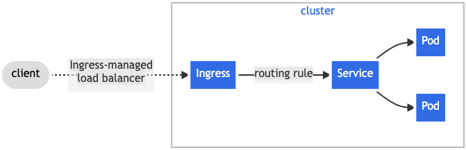

# <center>Ingress
Ingress是一个用于管理Kubernetes集群外部访问集群内部服务的 API 对象，访问的协议通常来说是HTTP/HTTPS。

## 简介
在Kubernetes集群中Ingress对外部暴露了内部的HTTP/HTTPS流量，流量的路由规则在Ingress资源中定义。


## IngressCalss
Ingress能够被不同的Controller来实现，通常来说每一种实现他们的配置都不一样。所以每一个Ingress资源都应该指定一个IngressCalss，表示要使用哪个controller来实现当前Ingress。
```yaml
apiVersion: networking.k8s.io/v1
kind: IngressClass
metadata:
  name: external-lb
  annotations:
    ingressclass.kubernetes.io/is-default-class: "true" # 通过此注解来将此IngressClass设置为默认的IngressClass
spec:
  controller: example.com/ingress-controller
  parameters:
    apiGroup: k8s.example.com
    kind: IngressParameters
    name: external-lb
```


## Ingress配置
```yaml
apiVersion: networking.k8s.io/v1
kind: Ingress
metadata:
  name: ingress-wildcard-host
spec:
  # 在k8s1.18之前的版本是通过给Ingress资源添加annotation来指定的。
  # kubernetes.io/ingress.class = nginx
  ingressClassName: nginx
  rules:
  - host: "foo.bar.com"
    http:
      paths:
      - pathType: Prefix
        path: "/bar"
        backend:
          service:
            name: service1
            port:
              number: 80
  - host: "*.foo.com"
    http:
      paths:
      - pathType: Prefix
        path: "/foo"
        backend:
          service:
            name: service2
            port:
              number: 80
```
注意：
> 在Kubernetes 1.18中引入了**ingressClassName**字段，用于表示当前Ingress资源使用的是哪个IngressController，在此之前是通过在Ingress资源
> 中添加一个annotation来实现的(例如：`kubernetes.io/ingress.class = nginx`)。

## TLS配置
### 使用secret保存服务器证书
```yaml
apiVersion: v1
kind: Secret
metadata:
  name: testsecret-tls
  namespace: default
data:
  tls.crt: base64 encoded cert
  tls.key: base64 encoded key
type: kubernetes.io/tls

---
apiVersion: networking.k8s.io/v1
kind: Ingress
metadata:
  name: tls-example-ingress
spec:
  tls:
  - hosts:
      - https-example.foo.com
    secretName: testsecret-tls
  rules:
  - host: https-example.foo.com
    http:
      paths:
      - path: /
        pathType: Prefix
        backend:
          service:
            name: service1
            port:
              number: 80
```

