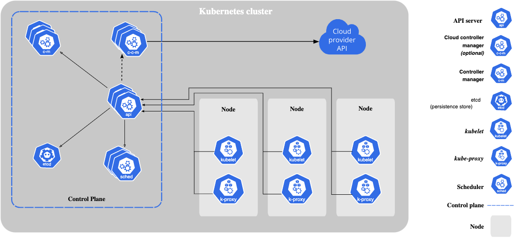

# 
Kubernetes Components
## 组件
一个完整的Kubernetes集群是由控制面(Master Nodes)和工作节点(Worker Nodes)组成。

### 控制面
控制面组件负责集群的决策(比如，调度)，监测集群事件，并对事件做出相应的响应。

* kube-apiserver
  > 对外暴露Kubernetes API，该组件是Kubernetes控制面最前面的组件。

* kube-scheduler
  > 负责为新创建的还没有分配worker node的POD分配一个合适的worker node。

* kube-controller-manager
  > 逻辑上每个controller都是一个单独的进程，但是为了降低复杂度，它们被编译进了一个单独的二进制文件中，并且运行在同一个进程中。
  
  常见的controller:

  * Node controller
  * Job controller
  * EndpointSlice controller
  * ServiceAccount controller 

* etcd
  > 存储Kubernetes集群的所有数据。

* cloud-controller-manager
  > 这个只有在云上运行kubernetes时才会有，并且和云供应商是相关的。

### 节点组件(Node Componentes)
节点组件运行在集群中的每个节点上。

* Kube-proxy
  > kube-proxy维护着节点上的网络规则。这些规则允许从集群内部或外部到你的POD之间的请求。如果节点所在的操作系统中有可用的包过滤层(packet filtering layer)，那么kube-proxy就会用它，否则kube-proxy会自己来转发相应的网络流量。

* Kubelet
  > kubelet会保证kubernetes调度到该节点上的POD中的容器的运行。kubelet并不会管理那些并非kubernetes创建的容器。

* Container runtime
  > 容器运行时负责在节点上运行容器的软件。Kubernetes支持containerd, CRI-O，以及任何实现了Kubernetes CRI(Container Runtime Interface)的软件。

## 插件(Addons)
插件使用(DaemonSet, Deployment等)来实现一些集群的功能。由于提供的是集群级别的功能，插件相关的资源都属于**kube-system**名称空间中。

* DNS
* Web UI(Dashboard)