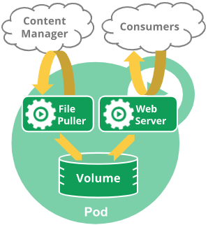

# <center>Pod
## Pod
### 生命周期
Pod和一个个独立运行的容器是一样的，都是临时的实体。Pod在其生命周期中只会被调度一次，即：Pod一旦被调度到某个节点，Pod会一直在该节点运行，直到Pod停止或者被终止。

Pod本身不具有自愈能力，如果Pod被调到某个节点而该节点之后失效，那么这个Pod也会被删除。

在Pod内部声明的volume和Pod具有相同的生命周期。



### Phase
* Pending
  > Pod已经被Kubernetes接受，但是至少有一个容器尚未创建、并准备好运行。这个过程包含Pod等待调度，以及通过网络下载image的时间。

* Running
  > Pod已经被调度到某个节点上，Pod中所有的容器都已经被创建了，至少有一个容器正在运行，或者牌启动、重启状态。

* Succeeded
  > Pod中所有的容器都已经成功终止，并且不会再重启。

* Failed
  > Pod中所有的容器都已经终止，并且至少有一个容器是因为终止失败。也就是说容器是以非0状态退出或被系统终止。

* Unknown
  > 因为某些原因无法获取Pod的状态，这种情况通常是因为无法与Pod所在的节点进行通信导致的。

注意：当Pod被删除时，通过**kubectl**命令查看Pod列表时会看到**Terminating**状态，但是这个状态并不是Pod的状态之一。
因为Pod在终止的时候有一个优雅终止，默认是30秒，这个**Terminating**表示的就是这个过程。可以使用**kubectl delete --force**来强制终止
Pod，此时就不会出现**Terminating**了。


## Container
### 状态
* Waiting
  > 处于该状态的容器仍然在运行，只不过它是在执行能让它正常运行的必要操作。比如，拉取镜像、应用secret数据。

* Running
  > 表示容器正在运行，没有任何问题。如果配置了**postStart**钩子，那么该hook已经执行完毕。

* Terminated
  > 表示容器要么运行完毕，要么由于某些原因运行出错。如果配置了**preStop**钩子，则此hook会在容器进入**Terminated**状态之前执行。

### 容器重启策略
可以通过**spec.restartPolicy**为Pod中的所有容器指定重启策略。可选值有三个：**Always**, **OnFailure**, 和 **Never**。默认值是**Always**。

当Pod中的容器退出时，**kubelet**会按此策略执行，该策略包含一个指数的退避延迟(10s,20s,40s,80s...)上限是5min。当容器成功运行10分钟后，kubelet会重置退避延迟时间。

### 容器生命周期
容器的生命周期目前只支持两种：**postStart**, **preStop**

* postStart
  > 别被它的名称迷惑了，**postStart**在容器被创建后会立即执行，所以无法保证它在容器的**entrypoint**之前或之后运行。
```yaml
spec:
  containers:
  - name: test
    lifecycle:
      postStart:
        exec:
          command:
          - "sleep"
          - "300"
      preStop:
        httpGet:
          host: "www.test.org"
          httpHeaders:
            name: token
            value: xxxxx
          path: /count/shutdown
          port: 3380
          scheme: https
```

### 容器探针
容器探针是由kubelet在某个容器上周期性的执行的
#### 探针类型

* livenessProbe
  > 存活探针，表示容器是否还在运行。如果探测失败，kubelet会根据restartPolicy会重启容器。如果容器没有提供**livenessProbe**探针，则默认的探测结果是Success

* readinessProbe
  > 就绪探针，表示容器是否可以响应请求。如果探测失败，**endpoint-controller**会把该Pod的IP地址从相应的service的endpoints中移除。如果容器没有提供该探针，则默认的探测结果是Success

* startupProbe
  > 启动探针，表示容器中的应用是否已经启动了。如果提供了该探针，那么在该探针成功之前，其他的探针都将会被禁用。如果该探针失败了，kubelet会按**restartPolicy**来重启容器。如果容器没有提供该探针，则默认的探测结果是Success


#### 探测机制
探测机制有以下几种：

* exec
  > 在容器内部使用exec执行命令，工作目录是容器的根目录(/)，指定的命令并不会在一个shell中运行，所以像shell中的一些特性是不生效的(比如：管道|)。如果想使用shell则需要手动指定要运行的shell。命令的返回值为**0**会被认为成功。

* grpc
  > 执行一个GRPC调用，目标应该实现GRPC health checks.

* httpGet
  > 在Pod的IP和指定的端口上执行一个HTTP GET请求。如果HTTP的状态码大于等于200，并且小于400，那么探测成功。

* tcpSocket
* > 在Pod的IP和指定的端口上执行一个TCP检查。如果端口是打开的，则探测成功。

#### 探测结果
* Success
* Failure
* Unknown
  > 探测失败，不会采取任何措施，kubelet会执行后续的探测。