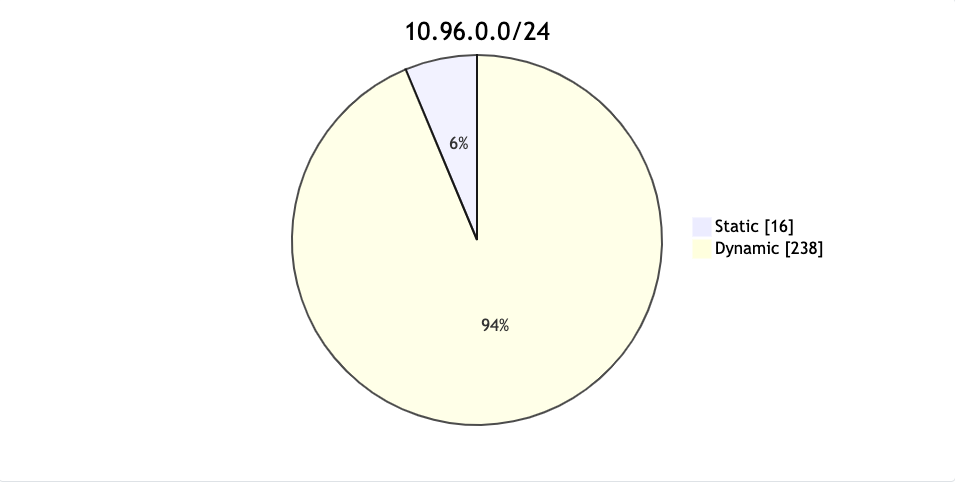

# <center> Service

## Service without selectors
当一个Service没有配置selector的时候，k8s并不会为其创建对应的EndpointSlice(endpoints)，因为不知道具体的Pod地址没办法创建。因此，这就需要使用者手动的来创建EndpointSlice。

在手动创建EndpointSlice的时候，需要注意：必需给这个EndpointSlice打上标签`kubernetes.io/service-name: your-service`，这里的`your-service`就是那个没有selector的Service。例如：
```yaml
apiVersion: discovery.k8s.io/v1
kind: EndpointSlice
metadata:
  name: my-service-1 # by convention, use the name of the Service
                     # as a prefix for the name of the EndpointSlice
  labels:
    # You should set the "kubernetes.io/service-name" label.
    # Set its value to match the name of the Service
    kubernetes.io/service-name: my-service
addressType: IPv4
ports:
  - name: '' # empty because port 9376 is not assigned as a well-known
             # port (by IANA)
    appProtocol: http
    protocol: TCP
    port: 9376
endpoints:
  - addresses:
      - "10.4.5.6" # the IP addresses in this list can appear in any order
      - "10.1.2.3"
```
虽然这种方式也可以将外部的服务映射进Kubernetes中，但是还是推荐使用`ExternalName`类型的service来替换。

## Headless Service
有时可能并不需要一个负载均衡和一个VIP，此时就可以使用**Headless service**。

实现**Headless Service**也比较简单，就是把`spec.ClusterIP: None`即可。

**Headless Service**可以用于与其他的服务发现进行集成，不必要与Kubernetes实现的进行绑定。

对于**Headless Service**来说，由于ClusterIP并没有分配，所以Kube-proxy并不会处理这类服务，并且也不会有负载均衡或代理之类的处理。至于DNS那边怎么记录，就取决于它的**Selector**
筛选的结果。

## Service类型
### ClusterIP
在Kubernetes内部的Cluster-IP段对服务进行暴露。选择该类型的话，服务只能在集群内部进行访问。这也是`Type`类型的默认值；

### NodePort
在每个worker节点上对应的端口上暴露服务，这个端口可以指定，如果不指定，那么就由Kubernetes来分配(范围：30000-32767).Kubernetes会给该service也分配一个ClusterIP，不然的话，节点是无法将收到的请求转发到对应的Pod上的。

使用NodePort可以很方便地和自己的负载均衡器结合起来；

默认情况下，创建了一个NodePort类型的服务后，kubernetes会把节点上所有可用的IP地址都监听起来，如果只想让NodePort监听指定的IP地址，则可以在启动**kube-proxy**的时候加上一个参数`--nodeport-addresses=192.168.1.100/32`

### LoadBalancer
  使用云供应商的load balancer来暴露服务，此时kubernetes会去云供应商那里申请一个IP，然后再把IP写入到该service的status字段中。
  
  默认情况下，Kubernetes就认为是创建了一个NodePort服务，然后LoadBalancer再把流量转发到这个nodeport上。但是如果云供应商的loadbalancer能够直接把流量路由到Pod中的话，是可以不用创建NodePort的，也就是把`spec.allocateLoadBalancerNodePorts: false`就行了，其默认值是`true`
### ExternalName
把service映射到externalName指向的位置(例如：foo.bar.example.com),是通过返回一个**CNAME**来实现的。
```yaml
apiVersion: v1
kind: Service
metadata:
  name: my-service
  namespace: prod
spec:
  type: ExternalName
  externalName: my.database.example.com
```
由于ExternalName类型的service是通过返回一个CNAME来实现的，所以**externalName**必须是一个域名，不能是一个IP，如果这里写了IP，那么结果就是认为这个IP是一个以点号分开的域名，导致结果有问题。如果要用IP的话，可以使用Headless service

## Service IP分配
在Kubernetes中给Service分配IP的方式有两种：
* 动态分配
  > 集群的控制面会自动从可用的service IP段中选择一个可用的IP用于分配。
  
* 手动分配
  > 用户手动指定一个可用的service IP

### 为什么需要手动指定Service IP
这里举一个最常见的例子：core-dns，默认情况下，所有的Pod的DNS都被设置为coredns的地址，那么这个地址就必须是固定的。常见的做法是选取地址段的第10个做为CoreDNS的service IP.

### 如果选择才能避免Service IP冲突
使用公式`min(max(16,cidrSize/16), 256`，将ServiceIP段分成了两个部分，也就是说前固定的范围是从[1,16]或者[1,256]，剩下的部分全部都用于动态分配。

需要注意的是：Kubernetes会先使用动态分配范围内的地址，当动态范围内的地址分配完后，也还是会使用静态范围内的IP的。

**例如：**

Service IP所在的网络地址是`10.96.0.0/24`

总共可用IP数：`2^8 -2 = 254`

静态段的偏移量：`min(max(16,256/16),256) = min(16,256) = 16`

静态段开始IP: `10.96.0.1`

静态段结束IP: `10.96.0.16`
